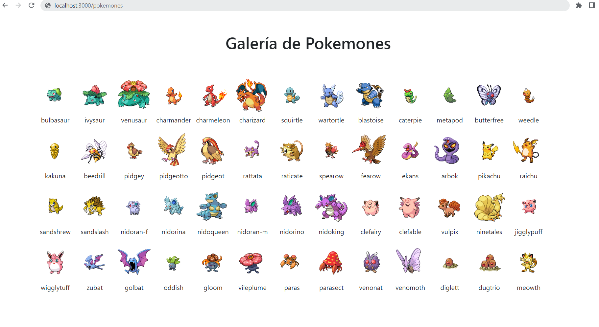

### Galería personalizada de pokemones

Desafío que consiste en un sitio web que muestra la imagen de 150 pokemones cada uno con sus respectivos nombres. Este proyecto no esta en desarrollo por lo que no se le realizaran modificaciones futuras.

### Materia aplicada:

- La asincronía
- Resolviendo un caso asíncrono
- Usando la asincronía en Node
- La asincronía y el consumo de APIs

### Visualización

